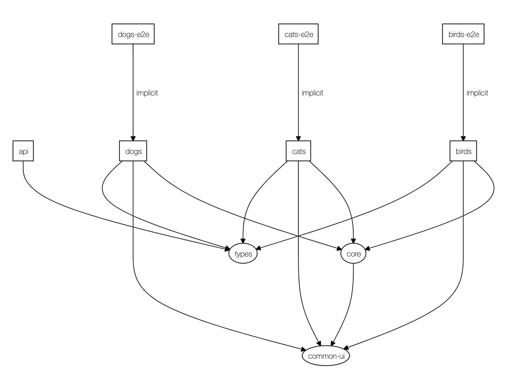

### Apps

- `dogs` - Uses redux websockets middleware. The websocket server is supplied by `api`.
- `cats` - A standard react/redux application that uses redux-toolkit.

#### Dependency Graph

<div align="center" style="padding: 20px">
    
</div>

#### Directory/File Structure

```
📦 apps
 ┣ 📂 cats
 ┃ ┣ 📂 src
 ┃ ┃ ┣ 📂 app
 ┃ ┃ ┃ ┣ 📜 App.tsx
 ┃ ┃ ┃ ┣ 📜 reducer.ts
 ┃ ┃ ┃ ┣ 📜 Routes.tsx
 ┃ ┃ ┃ ┗ 📜 store.ts
 ┗ ...other apps
📦 libs
 ┣ 📂 common-ui
 ┃ ┣ 📂 src
 ┃ ┃ ┣ 📂 components
 ┣ 📂 pets
 ┃ ┣ 📂 src
 ┃ ┃ ┣ 📂 common
 ┃ ┃ ┣ 📂 features
 ┃ ┃ ┃ ┗ 📂 core
 ┃ ┃ ┃ ┃ ┗ 📂 components
 ┃ ┃ ┃ ┃ ┗ 📂 hooks
 ┃ ┃ ┃ ┃ ┗ 📜 pets.slice.ts
 ┗ ...other libs
```

- Apps contain all of our applications that would get deployed
  - Should have an app folder that describes all of the application's routes and reducers
  - They should not contain any components, services, or business logic and only wire up libraries
- Libs contain code that should be shared with and build up applications
  - Can contain a common folder that can have redux reducer and shared components that relate only to the library
  - Most libraries should be split by business domain and have a set of features that relates to that library
    - A feature should be a set of components, hooks, and a redux slice
    - Features should not be nested inside each other
    - It might take multiple features to actually make up a whole view
  - Common-ui would just be presentational components (dumb components) or components that just use local state
  - Utilities library for maybe test or helper functions

### Component Folder Structure

```
📂 components
 ┣ 📜 Autocomplete.stories.tsx
 ┣ 📜 Autocomplete.test.tsx
 ┣ 📜 Autocomplete.tsx
```

It should be very easy to locate everything related to a component (story, test and styles). Styles and stories shouldn't be nested away in their own directories.

### Shared Redux Reducers

For apps to take advantage of state from shared reducers inside of the `pets` library they should be imported into the root reducer of the application (`apps/cats/src/app/reducer.ts`).

For example:

- We have a pets reducer (`libs/pets/src/features/core/pets.slice.ts`) that lives in the `pets` library and we want to take advantage of states changes that occur from dispatched actions inside of our `cats` application.
- We should import this into our `cats` application's root reducer like so:

```javascript
import { petsRootReducer } from '@pet-tracker/pets';

export const reducer = {
  ...petsRootReducer
};
```

We should also make sure that we namespace our actions correctly. So if an action is coming from our core library it should follow this pattern `lib/{lib name}/{feature}/{action}/{sub-action}`. For example, if I was to dispatch an action to fetch pets they would display as the following in redux devtools:

```
lib/pets/core/fetchPets/pending
lib/pets/core/fetchPets/fulfilled
```

This way it is easy to locate where actions live.
